# Introduction
The Financial Sentiment Classification Benchmark (FSC-Bench) provides a systematic evaluation framework for financial sentiment analysis, addressing key real-world challenges: performance on imbalanced data, temporal robustness, and domain adaptation. We benchmark three model families—traditional ML, domain-specific BERT variants, and general-purpose LLMs—across three core experiments. 

Experiment 1 (Baseline Performance) evaluates models on two financial news datasets: one small/imbalanced, one larger/balanced. Experiment 2 (Temporal Robustness) tests models trained on historical data against a recent news corpus to measure performance drift as market language evolves. Experiment 3 (Domain Robustness) assesses the same models on a high-quality, human-annotated Reddit dataset to evaluate adaptability from formal news to informal social media discourse.

Our results reveal critical insights: specialized models like FinBERT excel in-distribution but degrade under temporal and domain shifts, while general-purpose LLMs show surprising robustness to domain changes. This work raises a pivotal, underexplored research question: In a specialized domain, can a powerful, general-purpose LLM without domain-specific fine-tuning match or surpass a specialized smaller model? FSC-Bench offers reproducible code, data, and analysis to guide model selection and inspire robust financial NLP systems.

# Baselines
Loading pre-trained models​ involves downloading weights and configurations from repositories like Hugging Face, where models are pre-trained on massive text corpora, endowing them with fundamental language understanding. Fine-tuning with our data​ adapts these models to specific tasks (e.g., financial sentiment analysis) by continuing training on domain-specific datasets, requiring less time and data than training from scratch while typically yielding superior performance. Saving the model​ preserves the fine-tuned weights, configuration, and tokenizer locally, enabling direct inference, sharing, or deployment to production environments. 
<small>

| Model Name    | Model Version                    | Source                                                                                   |
|----------------|---------------------------------|------------------------------------------------------------------------------------------|
| MLP_TF_IDF     | Custom Implementation           | Traditional ML Baseline                                                                  |
| TextCNN        | Custom Implementation           | CNN-based Baseline                                                                       |
| BERT           | `bert-base-uncased`             | https://www.kaggle.com/xhlulu/huggingface-bert?select=bert-base-uncased                  |
| RoBERTa        | `roberta-base`                  | https://www.kaggle.com/datasets/dariussingh/huggingface-roberta                          |
| FinBERT        | `FinBERT-BaseVocab-Cased`       | https://www.kaggle.com/models/addarm/finbert                                             |
| Qwen2          | `Qwen/Qwen2-1.5B-Instruct`      | https://www.kaggle.com/models/qwen-lm/qwen2                                              |
</small>

# Datasets

  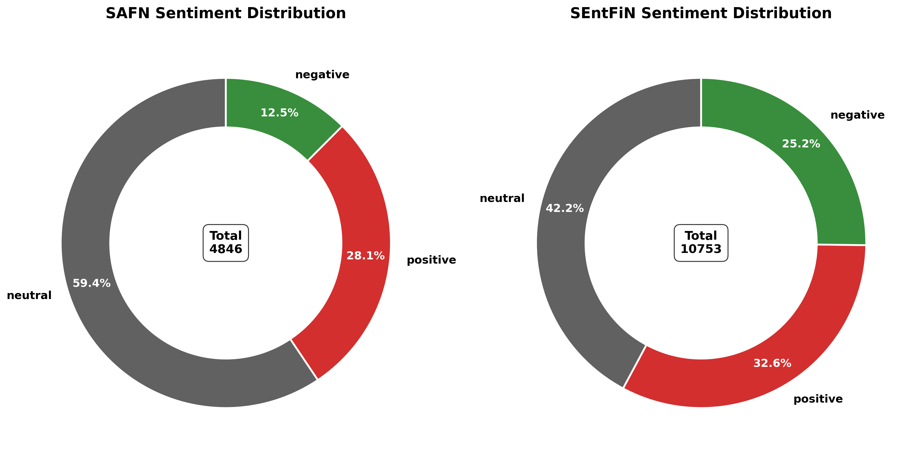
  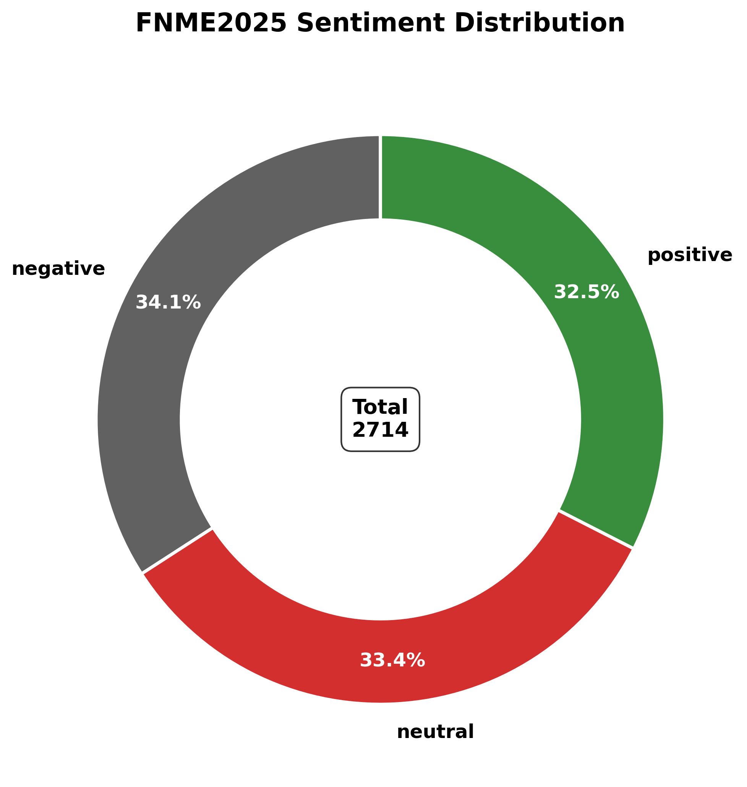
  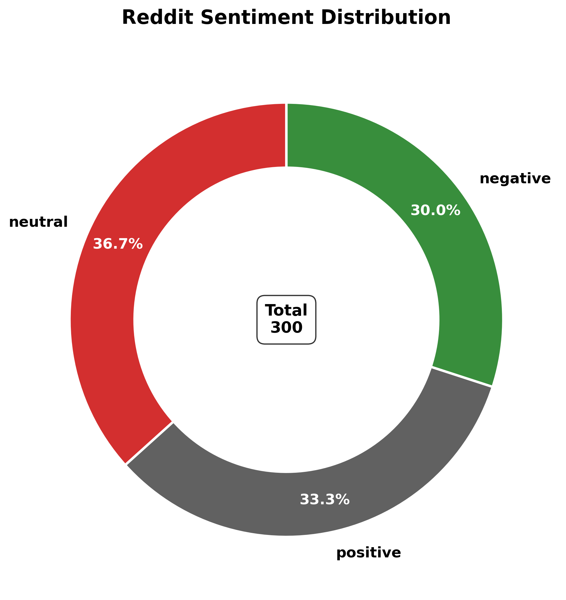

 

**SAFN:** https://www.kaggle.com/datasets/ankurzing/sentiment-analysis-for-financial-news 
This dataset contains the sentiments for financial news headlines from the perspective of a retail investor. Further details about the dataset can be found in: Malo, P., Sinha, A., Takala, P., Korhonen, P. and Wallenius, J. (2014): “Good debt or bad debt: Detecting semantic orientations in economic texts.” Journal of the American Society for Information Science and Technology.

**SEntFiN:** https://www.kaggle.com/datasets/ankurzing/aspect-based-sentiment-analysis-for-financial-news 
This file contains 10,700+ news headlines for which we have sentiment annotations for all the financial entities that appear in the headlines. Further details about the dataset can be found in: Sinha, A., Kedas, S., Kumar, R., & Malo, P. (2022). SEntFiN 1.0: Entity‐aware sentiment analysis for financial news. Journal of the Association for Information Science and Technology.

**FNME2025:** https://www.kaggle.com/datasets/pratyushpuri/financial-news-market-events-dataset-2025 
This synthetic dataset contains 3,024 records of financial news headlines centered around major market events from February 2025 to August 2025. The dataset captures real-time market dynamics, sentiment analysis, and trading patterns across global financial markets, making it ideal for financial analysis, sentiment modeling, and market prediction tasks.

**Reddit:** https://www.kaggle.com/datasets/gpreda/reddit-wallstreetsbets-posts/data 
Reddit posts from subreddit WallStreetBets, downloaded from https://www.reddit.com/r/wallstreetbets/ using praw (The Python Reddit API Wrapper). WallStreetBets (r/wallstreetbets, also known as WSB), is a subreddit where participants discuss stock and option trading. It has become notable for its profane nature and allegations of users manipulating securities. 
***⭐ We randomly selected 300 records from this dataset link which maintained a balanced sample ratio and manually labeled them to obtain a high-quality Reddit dataset.***

# Experiment 1 (Baseline Performance)

  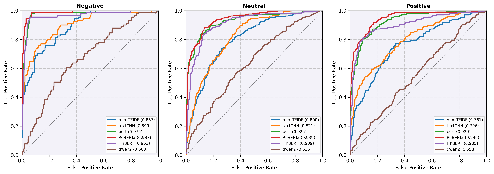 
  <strong style="font-size: 1.1em;">SAFN ROC</strong>

 

  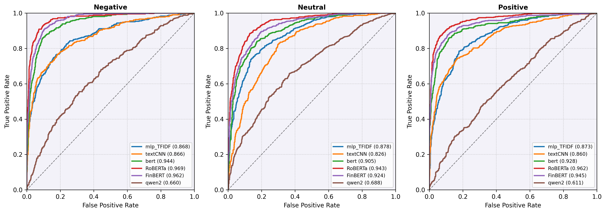 
  <strong style="font-size: 1.1em;">SEntFiN ROC</strong>

 

  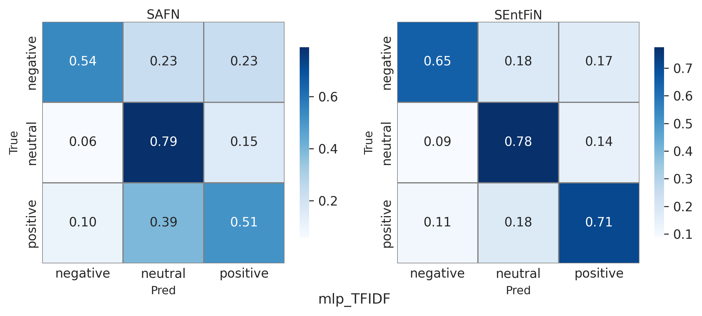
  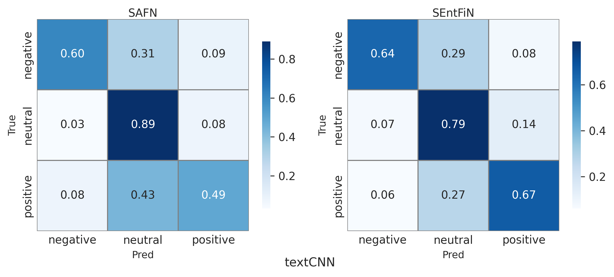
  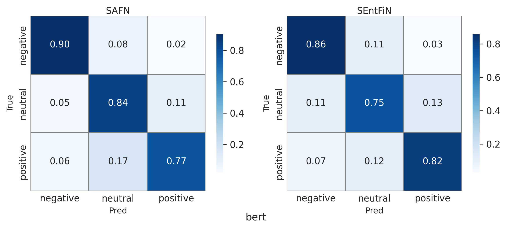

 

  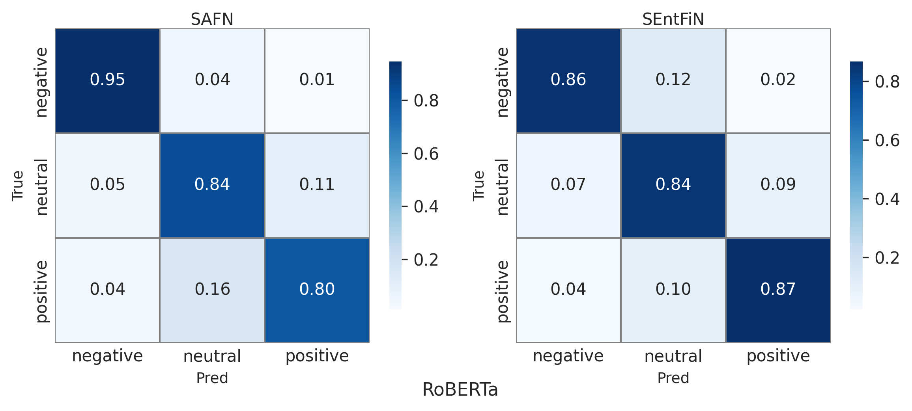
  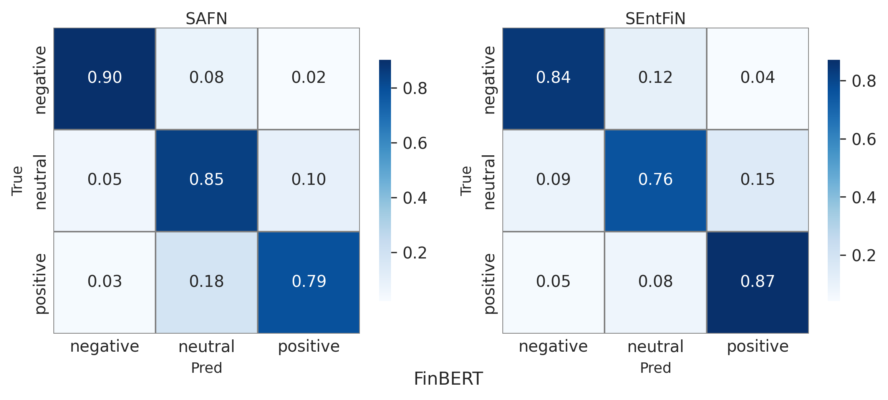
  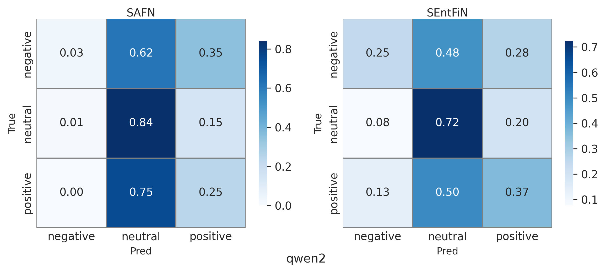

**Confusion Matrice**
​

# Experiment 2 (Temporal Robustness)

  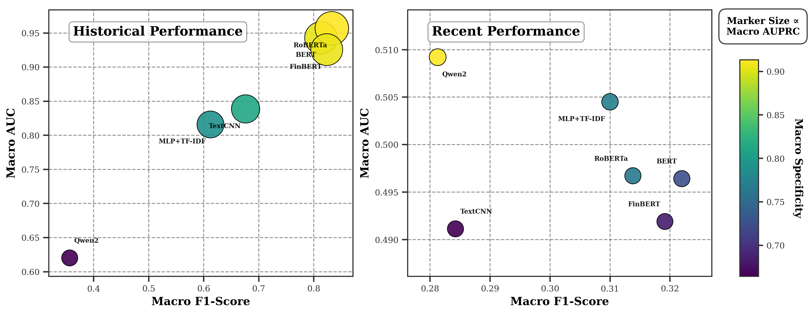 
  <strong style="font-size: 1.1em;">SAFN</strong>

 

  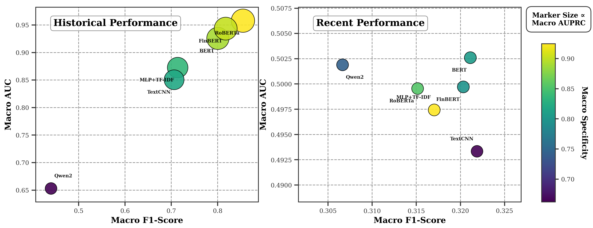 
  <strong style="font-size: 1.1em;">SEntFiN</strong>

 

  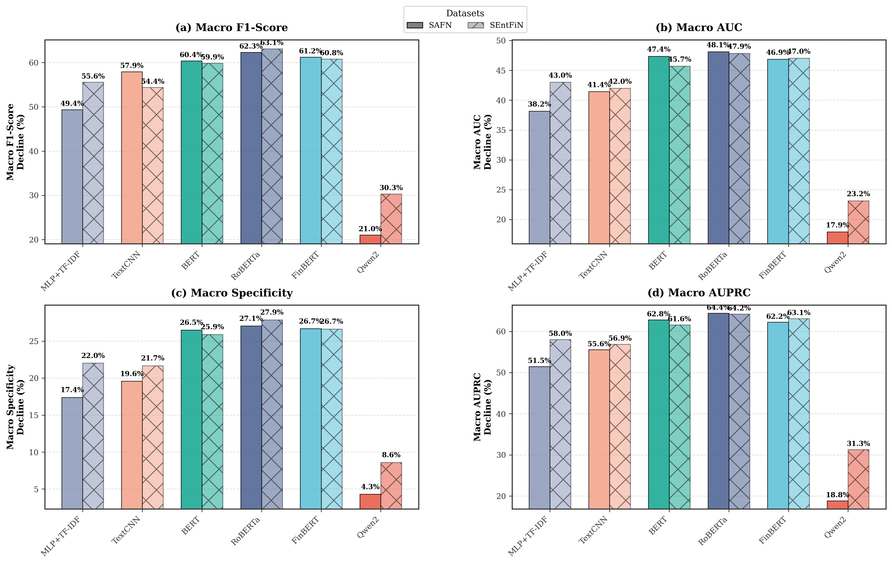 
  <strong style="font-size: 1.1em;">Decline</strong>

# Experiment 3 (Domain Robustness)​​

